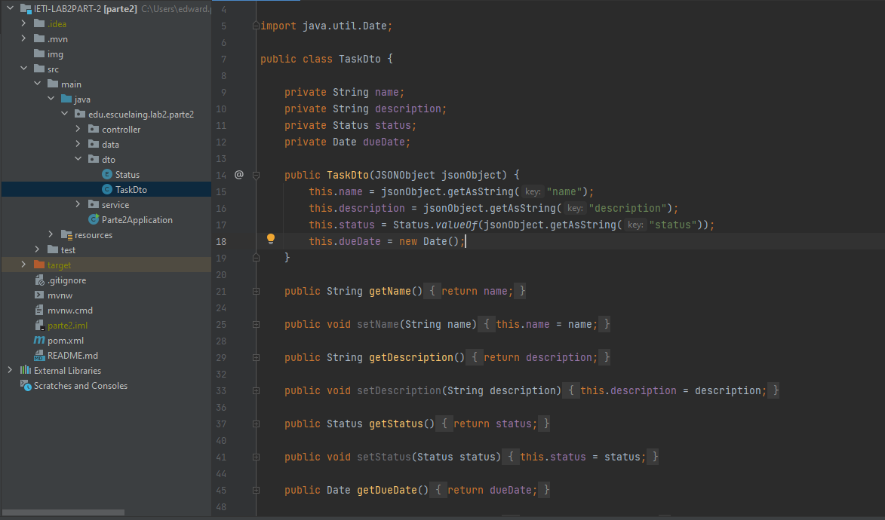
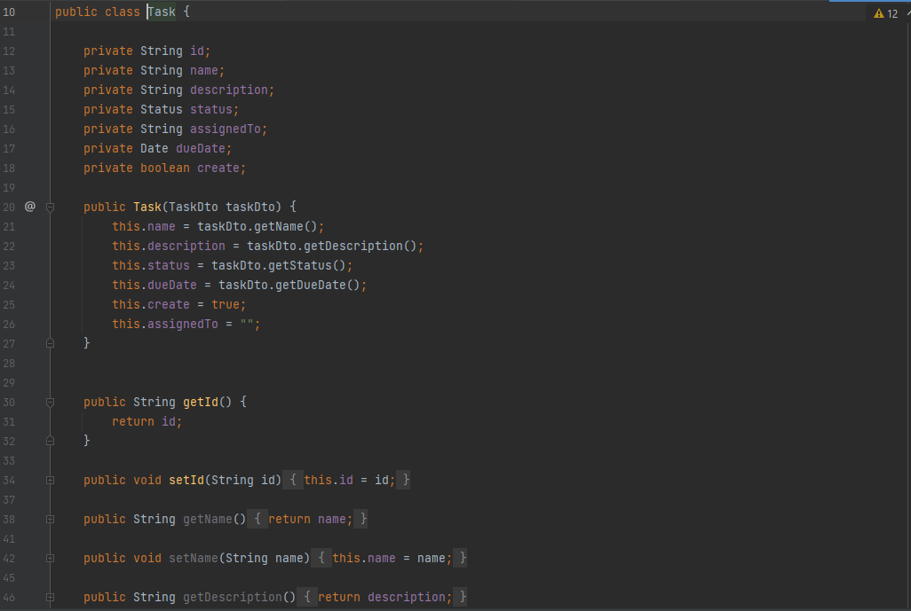
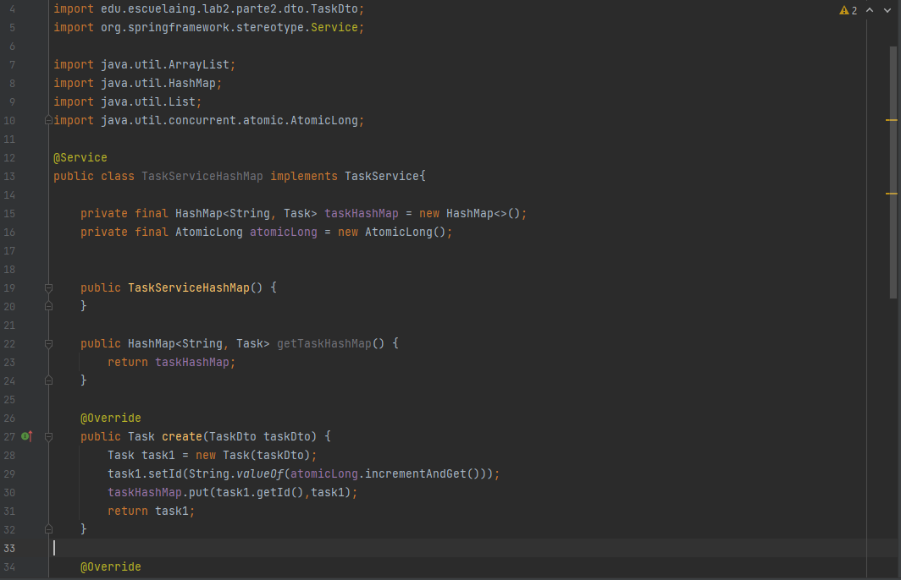
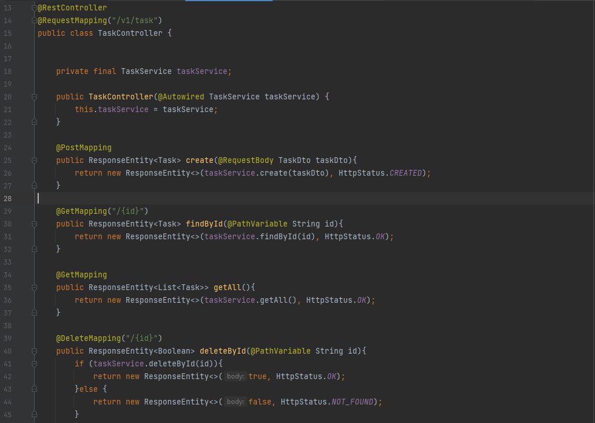
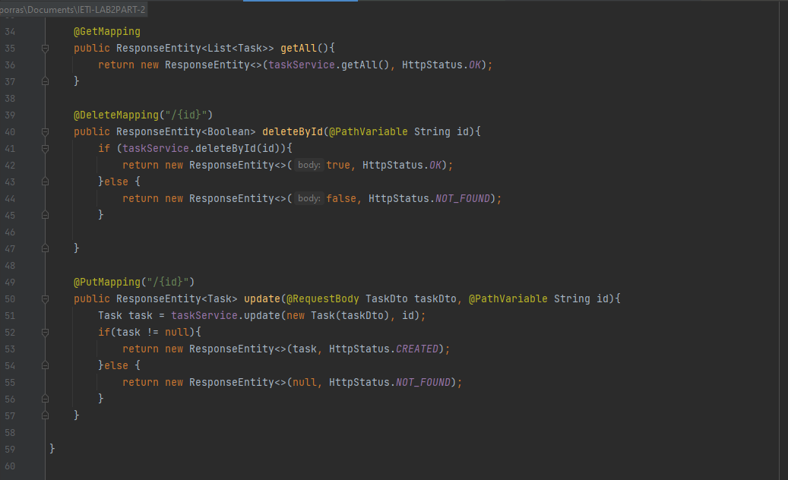
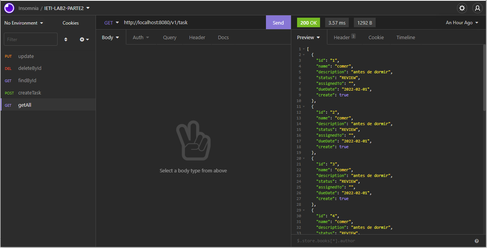
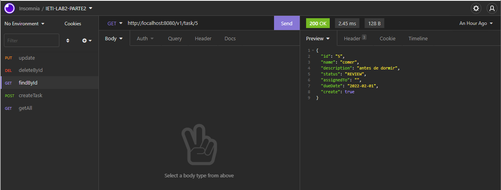

## Part 2: Implementing the Tasks Microservice RESTFUL API
1. Follow the previous part 10 first steps
2. Create a new package called ***dto*** and inside define your ***TaskDto*** object with at least the following fields:
    - name
    - description
    - status ( TODO, DOING, REVIEW and DONE )
    - assignedTo
    - dueDate
   


3. Create a new package called ***data*** and inside define your ***Task*** data object with at least the following fields:
    - id
    - name
    - description
    - status ( TODO, DOING, REVIEW and DONE )
    - assignedTo
    - dueDate
    - created



4. Create a new package called ***service*** and inside create the following interface:
   ```java
   public interface TaskService
   {
       Task create( Task task );

       Task findById( String id );
       
       List<Task> getAll();

       boolean deleteById( String id );

       Task update( Task task, String id );
   }
   ```
5. Create an implementation of the ***TaskService*** using a ***HashMap*** data structure inside.

   

6. Make sure your service implementation ***TaskServiceHashMap*** is injectable using the ***@Service*** annotation.
7. Implement your ***TaskController*** (Try to avoid copy paste, use the **User Microservice** as a reference but try doing it conciously).




8. Test ALL the endpoints of your API using **Insomnia**.






## 
